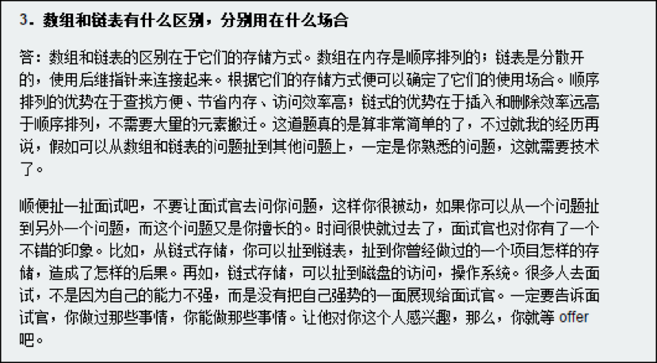

[TOC]


# 准备阶段

## 简历

- 简短的项目背景
- 完成的任务
- 为完成任务做了哪些工作，怎么做的
- 自己的贡献

## 为什么跳槽

## 技术需求

### 扎实的基础知识 

> 基础知识扎实全面，包括编程语言、数据结构、算法等

### 高质量代码

> 能写出正确的、完整的、鲁棒的高质量代码

### 清晰的思路

> 能思路清晰地分析、解决复杂问题

### 优化效率的能力

> 能从时间、空间复杂度两方面优化算法效率

### 优秀的综合能力

> 具备优秀的沟通能力、学习能力、发散思维能力等

## 应聘者提问环节


# 第一章 面试的流程


## 新浪大牛看待面试




> 以上来自[独酌逸醉-新浪技术部笔试题](http://www.perfect-is-shit.com/sina-written-exam.html)


## 把一个字符串转换成整数


# 第二章 面试需要的基础知识

编程语言 + 数据结构 + 算法和数据操作


## 在线挑战[剑指offer](https://www.nowcoder.com/ta/coding-interviews?query=&asc=true&order=&page=1)

## [大志非才不就，大才非学不成—我的博文资源汇总](http://www.cnblogs.com/edisonchou/p/3843287.html)

## 设计模式

### 实现singleton模式

1. 参考

> 在这里可以详细做一些练习：
> [Java：单例模式的七种写法](http://www.blogjava.net/kenzhh/archive/2011/09/02/357824.html):一般单例都是五种写法。懒汉，恶汉，双重校验锁，枚举和静态内部类。
> [面试题：线程安全的单例模式](http://www.iteye.com/topic/537563):文章最后的一些参考资料也很不错！


2. 项目中的实际应用


- jdk

Calendar.getInstance()

SecretKeyFactory.getInstance("PBEWithMD5AndDES").generateSecret(keySpec);

Cipher.getInstance(key.getAlgorithm())

MessageDigest.getInstance("MD5");

NumberFormat.getInstance().parse(params.get(key).toString().trim());


- 项目中，搜索instance得到

JVMMonitor ： public static final JVMMonitor instance = new JVMMonitor();

UdpLoggerClient ： log服务器客户端

ServerStatusLog ：服务器状态日志

ArenaMemberDbManager ： private static ArenaMemberDbManager arenaMemberDbManager = new ArenaMemberDbManager();

CurrencyProcessor ： 金钱处理器,单实例

TimeDifferenceStr：时间区分字符串

UseItemOperPool ： 道具使用支持类，单实例，用于为UseItemAction提供合适的UseItemOperation

MoveItemServicePool ： MoveItemService的对象池，用于根据源、目的包的id查询取得相应的MoveItemService，这些service对象都是公用的对象，单实例

DBConnection : 定义DBConnection

ShowOffPageNums：显示页码

PageNumForEach：每页显示数目

RobotManager : 机器人管理


3. 实战


枚举单例模式
- [如何正确地写出单例模式](http://wuchong.me/blog/2014/08/28/how-to-correctly-write-singleton-pattern/)
- [为什么java中用枚举实现单例模式会更好](https://my.oschina.net/zhoujy/blog/134958)
- [JAVA 枚举单例模式](https://segmentfault.com/q/1010000000646806)


## 数组

### 二维数组中的查找

> 在一个二维数组中，每一行都按照从左到右递增的顺序排序，每一列都按照 从上到下递增的顺序排序。

`常规思路`：

从第一个元素开始遍历查找， 会有多余的查找

`进阶思路`：

因为是递增的，所以要从数组的右上角开始比对，逐步跳到下一行、下一列来缩小范围，最终找到对应的数字

`测试用例，易错点`：

1.二维数组中没有这个数的时候处理

2.输入空指针会怎么样

`总结`：

当我们需要解决一个复杂的问题时，一个很有效的满发就是从一个具体的问题入手，通过分析简单的例子，试图寻找普遍的规律。比如该题目中给出的数组中查找数字7位例来一步步分析查找的过程。


`代码`：


```java
public class FindIt {
    public static void main(String[] args) {
        int [][] arrays={{1,2,8,9},{2,4,9,12},{4,7,10,13},{6,8,11,15}};
        for (int[] i : arrays) {
            System.out.print(i[0]);
            System.out.print(" ");
            System.out.print(i[1]);
            System.out.print(" ");
            System.out.print(i[2]);
            System.out.print(" ");
            System.out.print(i[3]);
            System.out.println();
        }
        FindIt findIt=new FindIt();
        System.out.println(findIt.find(arrays, 4, 4, 4));
    }
    boolean find(int [][] matrix,int rows,int columns,int number){
        boolean found=false;
        if (matrix!=null&&rows>0&&columns>0) {
            int row=0;
            int column=columns-1;
            while(row<rows&&column>=0){
                if (matrix[row][column]==number) {
                    found=true;
                    break;
                }
                else if(matrix[row][column]>number)
                    --column;
                else
                    ++row;
            }
        }
        return found;
    }
```
```
输出为

1 2 8 9
2 4 9 12
4 7 10 13
6 8 11 15
true
```

--------


## 字符串

### 把字符串中的每个空格替换成“%20”，例如输入“We are happy.”，则输出“We%20are%20happy.”

`常规思路`：

时间复杂度为O(n^2),假设字符串的长度是n。对每个空格字符，需要移动后面O(n)个字符，因此对含有O(n)个空格字符的字符串而言，总的时间效率是O(n^2)。

`进阶思路`：

时间复杂度为O(n)，从前向后转换为从后向前移动

先统计出字符串空格的总数，计算出替换之后的字符串的总长度。

准备两个指针p1,p2，p1指向原始字符串的末尾，而p2指向替换之后的字符串的末尾。

依次复制字符串的内容，直至p1碰到空格，替换成"%20"，把p1向前移动1格，把p2向前移动3格

直到p1和p2到相同位置上


`测试用例，易错点`：

1.空格在最前面或者最后面，中间，连续空格的情况

2.输入的字符串没有空格

3.字符串是null，是空字符串，只有一个空格字符，只有连续多个空格字符组成


`相关题目`：

有两个排序的数组A1和A2，内存在A1的末尾有足够多地空余空间容纳A2，请实现一个函数，把A2中的所有字符插入到A1中，并且所有的数字是排序的。

首先想到的办法是在A1中从头到尾复制数字，但这样会出现多次复制一个数字的情况。

更好的办法是从尾到头比较A1和A2的数字，并把较大的数字复制到A1的合适位置。

具体可以参考：[Java中如何把两个数组合并为一个](http://blog.csdn.net/jaycee110905/article/details/9179227)


## 链表

链表的创建、插入节点、删除节点等从操作都只需20行左右的代码就能实现，其代码量比较合适面试。

### 输入一个链表的头结点，从尾到头反过来打印每个节点的值

`常规思路`:

从头到尾遍历，然后把链表中节点的指针反转过来，改变链表的方向

`进阶思路`:

但上面那样做会改变链表的结构，可采用栈实现这种顺序。每经过一个节点的时候，把该节点放到一个栈中。当遍历完整个链表后，再从栈顶开始逐个输出节点的值。

`高阶思路`:

由于递归的本质上就是一个栈结构，可以采用递归来实现。每访问一个节点的时候，先递归输出它后面的节点，再输出该节点自身。


## 树

面试的时候提到的数，大部分都是二叉树，在二叉树中最重要的操作莫过于遍历，前中后序三种遍历 + 宽度优先遍历

二叉树的另外两个特例是堆和红黑树，堆分为最大堆和最小堆。在最大堆中根结点的值最大，在最小堆中根结点的值最小。有很多需要快速找到最大值或者最小值的问题都可以用堆来解决。

红黑树是把树种的结点定义为红、黑两种颜色，并通过规则确保从根节点到叶节点的最长路径的长度不超过最短路径的两倍。

### 重建二叉树

- 输入某二叉树的前序遍历和中序遍历的结果，请重建出该二叉树。假设输入的前序遍历和中序遍历的结果中都不含重复的数字。例如输入前序遍历序列{1,2,4,7,3,5,6,8}和中序遍历序列{4,7,2,1,5,3,8,6}，则重建二叉树并返回。


`思路`： 现根据前序遍历序列的第一个数字创建根节点接下来在中序遍历序列中找到根节点的位置，这样就能确定左、右子树节点的数量。

`应用`：[二叉树实际应用场景有哪些？]( https://www.zhihu.com/question/29263118/answer/58772633)


## 栈和队列

栈在计算机领域中被广泛应用，比如操作系统会给每个线程创建一个栈用来存储函数调用时各个函数的参数、返回地址及临时变量等。

> 这么说java的报错机制应该也类似了？

队列可用于遍历二叉树，数的宽度优先遍历算法中，我们在遍历某一层树的结点时，把结点的子节点放在一个队列里，以备下一层结点的遍历。


### 用两个栈来实现一个队列，完成队列的Push和Pop操作。 队列中的元素为int类型。


`思路`：push操作是把a,b,c3个元素压入stack1，

pop操作是把stack1中的元素弹出压入到stack2， 此时弹出stack2中的元素

`测试用例`:

- 往空的队列里添加、删除元素
- 往非空的队列里添加、删除元素
- 连续删除元素直至队列为空

`相关题目`：用两个队列实现一个栈

初始化操作是把a,b,c3个元素压入queue1，

pop操作是从queue1的头部一次删除a,b并插入到queue2中，再从queue1中删除c,这就相当于从栈中弹出c

push操作和pop操作类似

`拓展思考`：[用两个栈实现一个队列——我作为面试官的小结](http://www.cnblogs.com/wanghui9072229/archive/2011/11/22/2259391.html)


## 图

### 无向图


SLG游戏中解决最短路径的问题

- [数据结构基础温故-5.图（下）：最短路径](http://www.cnblogs.com/edisonchou/p/4691020.html)
- [无向图的处理算法（三）](https://segmentfault.com/a/1190000002680208)
- [无向图的最短路径求解算法之——Dijkstra算法(二)](http://sbp810050504.blog.51cto.com/2799422/1163565)
- [国立台湾师范大学-演算法笔记](http://www.csie.ntnu.edu.tw/~u91029/Circuit.html)
- [Java：寻找两点之间所有路径](http://mhqawjh.iteye.com/blog/414957)
- [求无向无权图起点到终点的所有路径](http://blog.csdn.net/collonn/article/details/18222723)


## 算法和数据操作


其中排序和查找是面试时考察算法的重点。在准备面试的时候，我们应该重点掌握二分查找、归并排序和快速排序，做到能随时正确、完整地写出他们的代码。

有很多算法都可以用递归和循环两种不同的方式实现。通常基于递归的实现方法会比较简洁，但性能不如循环，

位运算可以看成是一类特殊的算法。


`面试小提示`：

- 如果面试题是要求在排序的数组（或者部分排序的数组）中查找一个数字或者统计某个数字出现的次数，我们都可以尝试用二分查找算法。
- 哈希表和二叉排序树查找的重点在于考查对应的数据结构而不是算法。哈希表最主要的优点是我们利用它能够在O(1)时间查找某一元素，是效率最好的查找方式，但其缺点是需要额外的空间来实现哈希表；二叉排序树查找算法对应的数据结构是二叉搜索树
- 排序比查找要复杂一些，面试官会经常要求应聘者比较插入排序、冒泡排序、归并排序、快速排序等不同算法的优劣。强烈建议应聘者在准备面试的时候，一定要对各种排序算法的特点烂熟于胸，能够从额外空间消耗、平均时间复杂度和最差时间复杂度等方面去比较他们的优缺点。需要特别强调的是，很多公司的面试官喜欢在面试环节中要求应聘者写出快速排序的代码。
- 不同的排序算法使用的场合也不尽相同。快速排序虽然总体的平均效率是最好的，但也不是任何时候都是最优的算法。比如数组本身已经排好序了，而每一轮排序的时候都是以最后一个数字作为比较的标准，此时快速排序的效率只有O（n^2）。因此在这种场合快速排序就不是最优的算法。在面试的时候，如果面试官要求实现一个排序算法，那么应聘者一定要问清楚这个排序应用的环境是什么、有哪些约束条件。比如对什么数字进行排序，总共有多少个数字，数字的大小是在一个较小的范围内吗？是否可以使用辅助内存？


```java
package com.imop.lj.test.battle;

public class UrlTest {  
	
	void sortAges(int ages[], int length) throws Exception{
		if(ages == null || ages.length <= 0){
			return;
		}
		
		int oldestAge = 99;
		int timeofAge[] = new int[oldestAge + 1];
		
		for (int i = 0; i <= oldestAge; i++) {
			timeofAge[i] = 0;
		}
		
		for (int i = 0; i < length; i++) {
			int age = ages[i];
			if(age < 0 || age > oldestAge){
				throw new Exception("age out of age");
			}
			
			++ timeofAge[age];
		}
		
		int index = 0;
		for (int i = 0; i <= oldestAge; i++) {
			for (int j = 0; j < timeofAge[i]; j++) {
				ages[index] = i;
				++ index;
			}
		}
		
		for (int i = 0; i < ages.length; i++) {
			System.out.print(ages[i]+",");
		}
		
	}
	
	public static void main(String[] args) throws Exception {
		UrlTest url = new UrlTest();
		int ages[] = {2,5,7,8,9,57,34,23};
		url.sortAges(ages, ages.length);
		
	}
	
   
}  
```


java中的快速排序是什么？

[Arrays.sort](http://grepcode.com/file/repository.grepcode.com/java/root/jdk/openjdk/7u40-b43/java/util/Arrays.java#Arrays)

- [学习笔记----快速排序的java实现及其改良](http://www.imooc.com/article/6009)
- [快速排序](http://novoland.github.io/%E7%AE%97%E6%B3%95/2014/08/05/%E5%BF%AB%E9%80%9F%E6%8E%92%E5%BA%8F.html)


