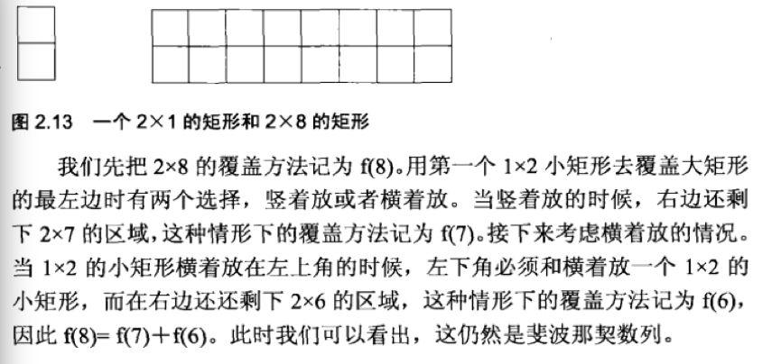

<!-- TOC -->

- [1. 分析复杂问题的手段](#1-分析复杂问题的手段)
- [2. 准备阶段](#2-准备阶段)
    - [2.1. 简历](#21-简历)
    - [2.2. 为什么跳槽](#22-为什么跳槽)
    - [2.3. 技术需求](#23-技术需求)
        - [2.3.1. 扎实的基础知识](#231-扎实的基础知识)
        - [2.3.2. 高质量代码](#232-高质量代码)
        - [2.3.3. 清晰的思路](#233-清晰的思路)
        - [2.3.4. 优化效率的能力](#234-优化效率的能力)
        - [2.3.5. 优秀的综合能力](#235-优秀的综合能力)
    - [2.4. 应聘者提问环节](#24-应聘者提问环节)
- [3. 第一章 面试的流程](#3-第一章-面试的流程)
    - [3.1. 新浪大牛看待面试](#31-新浪大牛看待面试)
    - [3.2. 把一个字符串转换成整数](#32-把一个字符串转换成整数)
- [4. 第二章 面试需要的基础知识](#4-第二章-面试需要的基础知识)
    - [4.1. 在线挑战[剑指offer](https://www.nowcoder.com/ta/coding-interviews?query=&asc=true&order=&page=1)](#41-在线挑战剑指offerhttpswwwnowcodercomtacoding-interviewsqueryasctrueorderpage1)
    - [4.2. [大志非才不就，大才非学不成—我的博文资源汇总](http://www.cnblogs.com/edisonchou/p/3843287.html)](#42-大志非才不就大才非学不成我的博文资源汇总httpwwwcnblogscomedisonchoup3843287html)
    - [4.3. 设计模式](#43-设计模式)
        - [4.3.1. 实现singleton模式](#431-实现singleton模式)
    - [4.4. 数组](#44-数组)
        - [4.4.1. 二维数组中的查找](#441-二维数组中的查找)
        - [4.4.2. 旋转数组的最小数字](#442-旋转数组的最小数字)
    - [4.5. 字符串](#45-字符串)
        - [4.5.1. 把字符串中的每个空格替换成“ ”，例如输入“We are happy.”，则输出“We are happy.”](#451-把字符串中的每个空格替换成例如输入we-are-happy则输出wearehappy)
    - [4.6. 链表](#46-链表)
        - [4.6.1. 输入一个链表的头结点，从尾到头反过来打印每个节点的值](#461-输入一个链表的头结点从尾到头反过来打印每个节点的值)
    - [4.7. 树](#47-树)
        - [4.7.1. 重建二叉树](#471-重建二叉树)
    - [4.8. 栈和队列](#48-栈和队列)
        - [4.8.1. 用两个栈来实现一个队列，完成队列的Push和Pop操作。 队列中的元素为int类型。](#481-用两个栈来实现一个队列完成队列的push和pop操作-队列中的元素为int类型)
    - [4.9. 图](#49-图)
        - [4.9.1. 无向图](#491-无向图)
    - [4.10. 算法和数据操作](#410-算法和数据操作)
    - [4.11. 递归和循环](#411-递归和循环)
        - [4.11.1. 斐波那契数列，现在要求输入一个整数n，请你输出斐波那契数列的第n项。n<=39](#4111-斐波那契数列现在要求输入一个整数n请你输出斐波那契数列的第n项n39)
    - [4.12. 位运算](#412-位运算)
        - [4.12.1. 输入一个整数，输出该数二进制表示中1的个数。其中负数用补码表示。例如把9表示成二进制是1001， 有2位是1.因此如果输入9，该函数输出2](#4121-输入一个整数输出该数二进制表示中1的个数其中负数用补码表示例如把9表示成二进制是1001-有2位是1因此如果输入9该函数输出2)
        - [4.12.2. 相关题目](#4122-相关题目)
        - [4.12.3. 数值的整数次方](#4123-数值的整数次方)
        - [4.12.4. 打印1到最大的n位数](#4124-打印1到最大的n位数)
        - [4.12.5. 在O(1)时间删除链表节点](#4125-在o1时间删除链表节点)
        - [4.12.6. 调整数组顺序使奇数位于偶数前面](#4126-调整数组顺序使奇数位于偶数前面)
    - [4.13. 代码的鲁棒性(Robust)](#413-代码的鲁棒性robust)
        - [4.13.1. 单向链表中倒数第k个结点](#4131-单向链表中倒数第k个结点)
        - [4.13.2. 反转链表](#4132-反转链表)
        - [4.13.3. 合并两个排序的链表](#4133-合并两个排序的链表)
        - [4.13.4. 树的子结构](#4134-树的子结构)
        - [4.13.5. 操作给定的二叉树，将其变换为源二叉树的镜像。](#4135-操作给定的二叉树将其变换为源二叉树的镜像)
        - [4.13.6. 顺时针打印矩阵](#4136-顺时针打印矩阵)
        - [4.13.7. 包含min函数的栈](#4137-包含min函数的栈)
        - [栈的压入,弹出序列](#栈的压入弹出序列)
        - [从上到下打印二叉树](#从上到下打印二叉树)
        - [二叉搜索树的后序遍历序列](#二叉搜索树的后序遍历序列)
        - [二叉树中和为某一值的路径](#二叉树中和为某一值的路径)
        - [复杂链表的复制](#复杂链表的复制)
        - [二叉搜索树与双向链表](#二叉搜索树与双向链表)
        - [4.13.8. 连续子数组的最大和](#4138-连续子数组的最大和)

<!-- /TOC -->
# 1. 分析复杂问题的手段

- 画图让抽象问题形象化
  - 在面试的时候应聘者需要向面试官解释自己的思路.对于复杂的问题,应聘者光用语言未必能够说清楚.这个时候可以画出几个图形,一边看着图形一边讲解,面试官就能更加轻松地理解应聘者的思路.这对应聘者是有益的,因为应聘者会觉得他有很好地沟通交流能力.

- 举例让抽象问题具体化

- 分解让复杂问题简单化


# 2. 准备阶段

## 2.1. 简历

- 简短的项目背景
- 完成的任务
- 为完成任务做了哪些工作，怎么做的
- 自己的贡献

## 2.2. 为什么跳槽

## 2.3. 技术需求

### 2.3.1. 扎实的基础知识 

> 基础知识扎实全面，包括编程语言、数据结构、算法等

### 2.3.2. 高质量代码

> 能写出正确的、完整的、鲁棒的高质量代码

### 2.3.3. 清晰的思路

> 能思路清晰地分析、解决复杂问题

### 2.3.4. 优化效率的能力

> 能从时间、空间复杂度两方面优化算法效率

### 2.3.5. 优秀的综合能力

> 具备优秀的沟通能力、学习能力、发散思维能力等

## 2.4. 应聘者提问环节


# 3. 第一章 面试的流程


## 3.1. 新浪大牛看待面试


> 以上来自[独酌逸醉-新浪技术部笔试题](http://www.perfect-is-shit.com/sina-written-exam.html)


## 3.2. 把一个字符串转换成整数


# 4. 第二章 面试需要的基础知识

编程语言 + 数据结构 + 算法和数据操作


本书源代码： https://github.com/zhedahht/ChineseCodingInterviewAppendix

## 4.1. 在线挑战[剑指offer](https://www.nowcoder.com/ta/coding-interviews?query=&asc=true&order=&page=1)

## 4.2. [大志非才不就，大才非学不成—我的博文资源汇总](http://www.cnblogs.com/edisonchou/p/3843287.html)

## 4.3. 设计模式

### 4.3.1. 实现singleton模式

1. 参考

> 在这里可以详细做一些练习：
> [Java：单例模式的七种写法](http://www.blogjava.net/kenzhh/archive/2011/09/02/357824.html):一般单例都是五种写法。懒汉，恶汉，双重校验锁，枚举和静态内部类。
> [面试题：线程安全的单例模式](http://www.iteye.com/topic/537563):文章最后的一些参考资料也很不错！


2. 项目中的实际应用


- jdk

Calendar.getInstance()

SecretKeyFactory.getInstance("PBEWithMD5AndDES").generateSecret(keySpec);

Cipher.getInstance(key.getAlgorithm())

MessageDigest.getInstance("MD5");

NumberFormat.getInstance().parse(params.get(key).toString().trim());


- 项目中，搜索instance得到

JVMMonitor ： public static final JVMMonitor instance = new JVMMonitor();

UdpLoggerClient ： log服务器客户端

ServerStatusLog ：服务器状态日志

ArenaMemberDbManager ： private static ArenaMemberDbManager arenaMemberDbManager = new ArenaMemberDbManager();

CurrencyProcessor ： 金钱处理器,单实例

TimeDifferenceStr：时间区分字符串

UseItemOperPool ： 道具使用支持类，单实例，用于为UseItemAction提供合适的UseItemOperation

MoveItemServicePool ： MoveItemService的对象池，用于根据源、目的包的id查询取得相应的MoveItemService，这些service对象都是公用的对象，单实例

DBConnection : 定义DBConnection

ShowOffPageNums：显示页码

PageNumForEach：每页显示数目

RobotManager : 机器人管理


3. 实战


枚举单例模式
- [如何正确地写出单例模式](http://wuchong.me/blog/2014/08/28/how-to-correctly-write-singleton-pattern/)
- [为什么java中用枚举实现单例模式会更好](https://my.oschina.net/zhoujy/blog/134958)
- [JAVA 枚举单例模式](https://segmentfault.com/q/1010000000646806)


## 4.4. 数组

### 4.4.1. 二维数组中的查找

> 在一个二维数组中，每一行都按照从左到右递增的顺序排序，每一列都按照 从上到下递增的顺序排序。

`常规思路`：

从第一个元素开始遍历查找， 会有多余的查找

`进阶思路`：

因为是递增的，所以要从数组的右上角开始比对，逐步跳到下一行、下一列来缩小范围，最终找到对应的数字

`测试用例，易错点`：

1.二维数组中没有这个数的时候处理

2.输入空指针会怎么样

`总结`：

当我们需要解决一个复杂的问题时，一个很有效的满发就是从一个具体的问题入手，通过分析简单的例子，试图寻找普遍的规律。比如该题目中给出的数组中查找数字7位例来一步步分析查找的过程。


`代码`：


```java
public class FindIt {
    public static void main(String[] args) {
        int [][] arrays={{1,2,8,9},{2,4,9,12},{4,7,10,13},{6,8,11,15}};
        for (int[] i : arrays) {
            System.out.print(i[0]);
            System.out.print(" ");
            System.out.print(i[1]);
            System.out.print(" ");
            System.out.print(i[2]);
            System.out.print(" ");
            System.out.print(i[3]);
            System.out.println();
        }
        FindIt findIt=new FindIt();
        System.out.println(findIt.find(arrays, 4, 4, 4));
    }
    boolean find(int [][] matrix,int rows,int columns,int number){
        boolean found=false;
        if (matrix!=null&&rows>0&&columns>0) {
            int row=0;
            int column=columns-1;
            while(row<rows&&column>=0){
                if (matrix[row][column]==number) {
                    found=true;
                    break;
                }
                else if(matrix[row][column]>number)
                    --column;
                else
                    ++row;
            }
        }
        return found;
    }
```
```
输出为

1 2 8 9
2 4 9 12
4 7 10 13
6 8 11 15
true
```


### 4.4.2. 旋转数组的最小数字

把一个数组最开始的若干个元素搬到数组的末尾，我们称之为数组的旋转。输入一个非递减排序的数组的一个旋转，输出旋转数组的最小元素。例如数组{3,4,5,1,2}为{1,2,3,4,5}的一个旋转，其中1,2移动到了5的后面，即3,4,5,1,2,该数组的最小值为1。
NOTE：给出的所有元素都大于0，若数组大小为0，请返回0。


`普通思路`：

从头到尾遍历一次，找到最小的元素，时间复杂度是O(n)

`进阶思路`：

没有利用输入的旋转数组的特性，肯定达不到面试官的要求

旋转之后的数组实际上可以划分为两个排序的子数组，而且前面的子数组的元素都大于或者等于后者子数组的元素。

还注意到最小的元素刚好是这两个子数组的分界线。

在排序的数组中我们可以用二分查找法实现O(logn)的查找。

`代码`：

```java
package com.imop.lj.test.battle;

public class UrlTest {

	int minNumberInRotateArray(int[] rotateArray) {
		int length = rotateArray.length;
		if (length == 0)
			return 0;

		int left = 0;
		int right = length - 1;
		int mid = 0;

		while (rotateArray[left] >= rotateArray[right]) {
			if (right - left == 1) {
				mid = right;
				break;
			}

			mid = (left + right) / 2;
			// 如果下标left、right、mid的元素均相等，用顺序查找
			if (rotateArray[left] == rotateArray[right] && rotateArray[mid] == rotateArray[left])
				return MinInOrder(rotateArray, left, right);

			// 利用二分查找缩小范围
			if (rotateArray[mid] >= rotateArray[left])
				left = mid;
			else if (rotateArray[mid] <= rotateArray[right])
				right = mid;
		}
		return rotateArray[mid];
	}

	private int MinInOrder(int[] rotateArray, int left, int right) {
		int result = rotateArray[left];
		for (int i = left + 1; i <= right; i++) {
			if (result > rotateArray[i])
				result = rotateArray[i];
		}
		return result;
	}

	public static void main(String[] args) throws Exception {
		UrlTest url = new UrlTest();
		int rotateArray[] = { 3, 4, 5, 1, 2 };
		System.out.println(url.minNumberInRotateArray(rotateArray));

	}

}
```


`考点`:

- 能否看出是二分查找
- 是否考虑到数组中有相同数字的特殊情况，该如何处理


接下来连续4天的外出，华山之行，

第一天 ： 坐车做了半天，晚上去大雁塔

第二天： 准备去历史博物馆，回民街

第三天：夜爬华山，观赏日出

第四天：兵马俑，坐飞机回去


--------


## 4.5. 字符串

### 4.5.1. 把字符串中的每个空格替换成“%20”，例如输入“We are happy.”，则输出“We%20are%20happy.”

`常规思路`：

时间复杂度为O(n^2),假设字符串的长度是n。对每个空格字符，需要移动后面O(n)个字符，因此对含有O(n)个空格字符的字符串而言，总的时间效率是O(n^2)。

`进阶思路`：

时间复杂度为O(n)，从前向后转换为从后向前移动

先统计出字符串空格的总数，计算出替换之后的字符串的总长度。

准备两个指针p1,p2，p1指向原始字符串的末尾，而p2指向替换之后的字符串的末尾。

依次复制字符串的内容，直至p1碰到空格，替换成"%20"，把p1向前移动1格，把p2向前移动3格

直到p1和p2到相同位置上


`测试用例，易错点`：

1.空格在最前面或者最后面，中间，连续空格的情况

2.输入的字符串没有空格

3.字符串是null，是空字符串，只有一个空格字符，只有连续多个空格字符组成


`相关题目`：

有两个排序的数组A1和A2，内存在A1的末尾有足够多地空余空间容纳A2，请实现一个函数，把A2中的所有字符插入到A1中，并且所有的数字是排序的。

首先想到的办法是在A1中从头到尾复制数字，但这样会出现多次复制一个数字的情况。

更好的办法是从尾到头比较A1和A2的数字，并把较大的数字复制到A1的合适位置。

具体可以参考：[Java中如何把两个数组合并为一个](http://blog.csdn.net/jaycee110905/article/details/9179227)


## 4.6. 链表

链表的创建、插入节点、删除节点等从操作都只需20行左右的代码就能实现，其代码量比较合适面试。

### 4.6.1. 输入一个链表的头结点，从尾到头反过来打印每个节点的值

`常规思路`:

从头到尾遍历，然后把链表中节点的指针反转过来，改变链表的方向

`进阶思路`:

但上面那样做会改变链表的结构，可采用栈实现这种顺序。每经过一个节点的时候，把该节点放到一个栈中。当遍历完整个链表后，再从栈顶开始逐个输出节点的值。

`高阶思路`:

由于递归的本质上就是一个栈结构，可以采用递归来实现。每访问一个节点的时候，先递归输出它后面的节点，再输出该节点自身。


## 4.7. 树

面试的时候提到的数，大部分都是二叉树，在二叉树中最重要的操作莫过于遍历，前中后序三种遍历 + 宽度优先遍历

二叉树的另外两个特例是堆和红黑树，堆分为最大堆和最小堆。在最大堆中根结点的值最大，在最小堆中根结点的值最小。有很多需要快速找到最大值或者最小值的问题都可以用堆来解决。

红黑树是把树种的结点定义为红、黑两种颜色，并通过规则确保从根节点到叶节点的最长路径的长度不超过最短路径的两倍。

### 4.7.1. 重建二叉树

- 输入某二叉树的前序遍历和中序遍历的结果，请重建出该二叉树。假设输入的前序遍历和中序遍历的结果中都不含重复的数字。例如输入前序遍历序列{1,2,4,7,3,5,6,8}和中序遍历序列{4,7,2,1,5,3,8,6}，则重建二叉树并返回。


`思路`： 现根据前序遍历序列的第一个数字创建根节点接下来在中序遍历序列中找到根节点的位置，这样就能确定左、右子树节点的数量。

`应用`：[二叉树实际应用场景有哪些？]( https://www.zhihu.com/question/29263118/answer/58772633)


## 4.8. 栈和队列

栈在计算机领域中被广泛应用，比如操作系统会给每个线程创建一个栈用来存储函数调用时各个函数的参数、返回地址及临时变量等。

> 这么说java的报错机制应该也类似了？

队列可用于遍历二叉树，数的宽度优先遍历算法中，我们在遍历某一层树的结点时，把结点的子节点放在一个队列里，以备下一层结点的遍历。


### 4.8.1. 用两个栈来实现一个队列，完成队列的Push和Pop操作。 队列中的元素为int类型。


`思路`：push操作是把a,b,c3个元素压入stack1，

pop操作是把stack1中的元素弹出压入到stack2， 此时弹出stack2中的元素

`测试用例`:

- 往空的队列里添加、删除元素
- 往非空的队列里添加、删除元素
- 连续删除元素直至队列为空

`相关题目`：用两个队列实现一个栈

初始化操作是把a,b,c3个元素压入queue1，

pop操作是从queue1的头部一次删除a,b并插入到queue2中，再从queue1中删除c,这就相当于从栈中弹出c

push操作和pop操作类似

`拓展思考`：[用两个栈实现一个队列——我作为面试官的小结](http://www.cnblogs.com/wanghui9072229/archive/2011/11/22/2259391.html)


## 4.9. 图

### 4.9.1. 无向图


SLG游戏中解决最短路径的问题

- [数据结构基础温故-5.图（下）：最短路径](http://www.cnblogs.com/edisonchou/p/4691020.html)
- [无向图的处理算法（三）](https://segmentfault.com/a/1190000002680208)
- [无向图的最短路径求解算法之——Dijkstra算法(二)](http://sbp810050504.blog.51cto.com/2799422/1163565)
- [国立台湾师范大学-演算法笔记](http://www.csie.ntnu.edu.tw/~u91029/Circuit.html)
- [Java：寻找两点之间所有路径](http://mhqawjh.iteye.com/blog/414957)
- [求无向无权图起点到终点的所有路径](http://blog.csdn.net/collonn/article/details/18222723)


## 4.10. 算法和数据操作


其中排序和查找是面试时考察算法的重点。在准备面试的时候，我们应该重点掌握二分查找、归并排序和快速排序，做到能随时正确、完整地写出他们的代码。

有很多算法都可以用递归和循环两种不同的方式实现。通常基于递归的实现方法会比较简洁，但性能不如循环，

位运算可以看成是一类特殊的算法。


`面试小提示`：

- 如果面试题是要求在排序的数组（或者部分排序的数组）中查找一个数字或者统计某个数字出现的次数，我们都可以尝试用二分查找算法。
- 哈希表和二叉排序树查找的重点在于考查对应的数据结构而不是算法。哈希表最主要的优点是我们利用它能够在O(1)时间查找某一元素，是效率最好的查找方式，但其缺点是需要额外的空间来实现哈希表；二叉排序树查找算法对应的数据结构是二叉搜索树
- 排序比查找要复杂一些，面试官会经常要求应聘者比较插入排序、冒泡排序、归并排序、快速排序等不同算法的优劣。强烈建议应聘者在准备面试的时候，一定要对各种排序算法的特点烂熟于胸，能够从额外空间消耗、平均时间复杂度和最差时间复杂度等方面去比较他们的优缺点。需要特别强调的是，很多公司的面试官喜欢在面试环节中要求应聘者写出快速排序的代码。
- 不同的排序算法使用的场合也不尽相同。快速排序虽然总体的平均效率是最好的，但也不是任何时候都是最优的算法。比如数组本身已经排好序了，而每一轮排序的时候都是以最后一个数字作为比较的标准，此时快速排序的效率只有O（n^2）。因此在这种场合快速排序就不是最优的算法。在面试的时候，如果面试官要求实现一个排序算法，那么应聘者一定要问清楚这个排序应用的环境是什么、有哪些约束条件。比如对什么数字进行排序，总共有多少个数字，数字的大小是在一个较小的范围内吗？是否可以使用辅助内存？


```java
package com.imop.lj.test.battle;

public class UrlTest {  
	
	void sortAges(int ages[], int length) throws Exception{
		if(ages == null || ages.length <= 0){
			return;
		}
		
		int oldestAge = 99;
		int timeofAge[] = new int[oldestAge + 1];
		
		for (int i = 0; i <= oldestAge; i++) {
			timeofAge[i] = 0;
		}
		
		for (int i = 0; i < length; i++) {
			int age = ages[i];
			if(age < 0 || age > oldestAge){
				throw new Exception("age out of age");
			}
			
			++ timeofAge[age];
		}
		
		int index = 0;
		for (int i = 0; i <= oldestAge; i++) {
			for (int j = 0; j < timeofAge[i]; j++) {
				ages[index] = i;
				++ index;
			}
		}
		
		for (int i = 0; i < ages.length; i++) {
			System.out.print(ages[i]+",");
		}
		
	}
	
	public static void main(String[] args) throws Exception {
		UrlTest url = new UrlTest();
		int ages[] = {2,5,7,8,9,57,34,23};
		url.sortAges(ages, ages.length);
		
	}
	
   
}  
```


java中的快速排序是什么？

[Arrays.sort](http://grepcode.com/file/repository.grepcode.com/java/root/jdk/openjdk/7u40-b43/java/util/Arrays.java#Arrays)

- [学习笔记----快速排序的java实现及其改良](http://www.imooc.com/article/6009)
- [快速排序](http://novoland.github.io/%E7%AE%97%E6%B3%95/2014/08/05/%E5%BF%AB%E9%80%9F%E6%8E%92%E5%BA%8F.html)


## 4.11. 递归和循环


### 4.11.1. 斐波那契数列，现在要求输入一个整数n，请你输出斐波那契数列的第n项。n<=39

`常规思路`：

递归的揭发有很严重的效率问题，并要求我们分析原因

原因： 我们用树形结构来表示这种依赖关系，


发现这棵树中有很多节点是重复的，而且重复的结点数会随着n的增大而急剧增加，这意味着计算量会随着n的增大而急剧增大。

事实上，用递归方法计算的时间复杂度是n的指数的方式递增的。

```java
package com.imop.lj.test.battle;

public class UrlTest {

	public long fibonacci(int n){
		  if(n <= 0) return 0;
		  if(n == 1) return 1;
		  
		  return fibonacci(n - 1) + fibonacci(n -2);
	}
	
  //进阶解法，时间复杂度是O(n)
	public long fibonacci2(int n){
		  int[] result = {0 , 1};
		  if(n < 2) return result[n];
		  
		  long fibNMinusOne = 1;
		  long fibNMinusTwo = 0;
		  long fibN = 0;
		  for(int i = 2; i <= n; i++){
		    fibN = fibNMinusOne + fibNMinusTwo;
		    
		    fibNMinusTwo = fibNMinusOne;
		    fibNMinusOne = fibN;
		  }
		  
		  return fibN;
	}

	public static void main(String[] args) throws Exception {
		UrlTest url = new UrlTest();
		long start = System.currentTimeMillis();
		long fibN = url.fibonacci(45);
		long end = System.currentTimeMillis();
		System.out.println("fibonacci time cost:" + (end - start) + "\nvalue:" +fibN);
		
		long start1 = System.currentTimeMillis();
		long fibN1 = url.fibonacci(45);
		long end1 = System.currentTimeMillis();
		System.out.println("\nfibonacci1 time cost:" + (end1 - start1) + "\nvalue:" +fibN1);

	}

}
```


`类似的斐波那契数列的应用`：

一只青蛙一次可以跳上1级台阶，也可以跳上2级，求该青蛙跳上一个n级的台阶总共有多少中跳法。

> 首先我们考虑最简单的情况。如果只有1级台阶，那显然只有一种跳法。如果有2级台阶，那就有两种跳的方法了：一种是分两次跳，每次跳1级；另外一种是一次跳2级。
接着我们再来讨论一般情况。我们把n级台阶时的跳法看成是n的函数，记为f(n)。当n>2时，第一次跳的时候就有两种不同的选择：一是第一次只跳1级，此时跳法数目等于后面剩下的n-1级台阶的跳法数目，即为f(n-1);另外一种选择是第一次跳2级，此时跳法数目等于后面剩下的n-2级台阶的跳法数目，即为f(n-2)。因此n级台阶的不同跳法的总数f(n) = f(n-1) + f(n-2);这就是斐波那契数列


`扩展考点`：

在青蛙🐸台阶的问题中，如果把条件改成：一只青蛙一次可以跳上1级台阶，也可以跳上2级……，它也可以跳上n级，此时该青蛙跳上一个n级的台阶总共有多少种跳法？我们用数学归纳法可以证明f(n) = 2^(n-1)

举例：
1级有1，1种跳法
2级有（1+1），2两种跳法
3级有（1+1+1），（1+ 2）， （2+1），3 四种跳法

`相关题目`：




## 4.12. 位运算


位运算总共只有五种运算： 与、或、异或、左移和右移。


左移运算符 m<< n 表示把m左移n位，左移n位的时候，最左边的n位将被丢弃，同时在最右边补上n个0
例如

`00001010 << 2 = 00101000`

`10001010 << 3 = 01010000`

右移运算符m >> n 表示把m右移n位，右移n位的时候，最右边的n位将被丢弃。但右移时处理最左边位的情况要稍微复杂一点。
如果数字是一个无符号数值，则用0填补最左边的n位。
如果数字是一个有符号数值，则用数字的符号位填补最左边的n位。也就是说如果数组原先是一个正数，则右移之后再最左边补n个0；
如果数字原先是负数，则右移之后再最左边补n个1
例如：

`00001010 >> 2 = 00000010`

`10001010 >> 3 = 11110001`


### 4.12.1. 输入一个整数，输出该数二进制表示中1的个数。其中负数用补码表示。例如把9表示成二进制是1001， 有2位是1.因此如果输入9，该函数输出2

`常规思路`：

移动整数，判断整数的最右边数是不是1，是的话加1

这样会带来两个问题：

- 把整数右移一位和把整数除以2 那个高效？ 毫无疑问是前者
- 如果输入的数是一个负数，比如0x80000000, 那最后就会变成0xFFFFFFFF(0xffffffff = 1111 1111 1111 1111 1111 1111 1111 1111)，最终陷入死循环  

- [十大Intellij IDEA快捷键](http://blog.csdn.net/dc_726/article/details/42784275)

```java
int NumberOf1(int n)
{
	int count = 0;
	while(n){
		if(n & 1)
			count ++;

		n = n >> 1;
	}

	return count;
}
```

`进阶思路`：

左移， 判断n的最低位是不是1
循环的次数等于整数二进制的位数，32位的整数需要循环32次。

```java
int NumberOf1(int n)
{
	int count = 0;
	unsigned int flag = 1;
	while(flag){
		if(n & flag)
			count ++;

		flag = flag << 1;
	}

	return count;
}
```

`终极思路`：

把一个整数减1， 再和原数做与运算，会把该整数最右边一个1变成0.那么一个整数的二进制表示中有多少个1，就可以进行多少次这样的操作，很多二进制的问题都可以用这个思路解决。

```java

int NumberOf1(int n){
	int count = 0;
	while(n){
		++ count;
		n = (n -1) & n;
	}

	return count;
}


```

### 4.12.2. 相关题目

- 用一条语句判断一个整数是不是2的整数次方
> 把这个整数减去1之后再和他自己做与原酸。这个整数中唯一的1就会变成0
- 输入两个整数m和n，计算需要改变m的二进制表示中的多少位才能得到n。
> 第一步求这两个数的异或，第二步统计异或结果中1的位数


### 4.12.3. 数值的整数次方

给定一个double类型的浮点数base和int类型的整数exponent。求base的exponent次方。

`基本思路`： 输入的数小于1， 或者是零，负数的时候怎么办？

```java
 double power(double base, int exponent){
        double result = 1.0;
        for (int i = 0; i <= exponent; i++) {
            result *= base;
        }

        return result;
    }
```

`进阶思路`:  进行了全面的考虑， 但是效率上有待提高

```java

/**
 * Created by xiaohouzi on 17/5/9.
 */
public class UrlTest {
    public static void main(String[] args) {
        UrlTest urlTest = new UrlTest();
        System.out.println(urlTest.power(2, 3));
    }


    boolean g_InvalidInput = false;

    double power(double base, int exponent){

        g_InvalidInput = false;

        if (equal(base, 0.0) && exponent < 0){
            g_InvalidInput = true;
            return 0.0;
        }

        if(exponent < 0){
            exponent = -exponent;
        }

        double result = PowerWithUnsignedExponent(base, exponent);
        if(exponent < 0){
            result = 1.0 / result;
        }

        return result;
    }

    private double PowerWithUnsignedExponent(double base, int exponent) {
        double result = 1.0;
        for (int i = 0; i <= exponent; i++) {
            result *= base;
        }

        return result;
    }

    private boolean equal(double num1, double num2) {
        if ((num1 - num2 > -0.0000001)
                && (num1 - num2 < 0.0000001)){
            return true;
        }else{
            return false;
        }
    }


}
```

`终极思路`: 全面又效率高的方法

用右移运算符代替了除以2
用位运算符代替了求余运算符来判断一个数是奇数还是偶数。

位运算的效率比乘除法及求余运算的效率要高很多。

```java

 private double PowerWithUnsignedExponent(double base, int exponent) {
        if (exponent == 0) return 1;
        if (exponent == 1) return base;

        double result = PowerWithUnsignedExponent(base, exponent >> 1);
        result *= result;
        if((exponent & 0x1) == 1){
            result *= base;
        }

        return result;
    }
```


### 4.12.4. 打印1到最大的n位数

`基本思路`: 如果输入的n很大的时候， 返回的结果用int或long都会溢出

```java
 void Print1ToMaxOfNDigits_1(int n){
        int number = 1;
        int i = 0;
        while (i++ < n) number *= 10;

        System.out.println("number" + number);

        for ( i = 1; i < number; i++) {
            System.out.println(i + "\t");
        }
    }

```

`进阶思路`:

最常用也是最容易的方法是用字符串或者数组表达大数.

```java

   void Print1ToMaxOfNDigits_1(int n){
        if (n <= 0){
            return;
        }

        char[] number = new char[n + 1];
        number[n] = '\0';

        while (!increment(number)){
            printNumber(number);
        }

    }

    private void printNumber(char[] number) {
        boolean isBeginning0 = true;
        int nLength = number.length;

        for (int i = 0; i < nLength; i++) {
            if (isBeginning0 && number[i] != '0'){
                isBeginning0 = false;
            }

            if (!isBeginning0){
                System.out.print(number[i]);
            }

            System.out.print("\t");
        }
    }

    private boolean increment(char[] number) {
        boolean isOverflow = false;
        int nTaskOver = 0;
        int nLength = number.length;
        for (int i = nLength - 1; i >= 0; i--) {
            int nSum = number[i] - '0' + nTaskOver;
            if (i == nLength - 1){
                nSum ++;
            }

            if (nSum >= 10){
                if (i == 0){
                    isOverflow = true;
                }else{
                    nSum -= 10;
                    nTaskOver = 1;
                    number[i] = (char) ('0' + nSum);
                }
            }else{
                number[i] = (char) ('0' + nSum);
                break;
            }
        }

        return isOverflow;
    }

```
`终极思路`: n位所有十进制数其实就是n个从0到9的全排列

```java
   void Print1ToMaxOfNDigits_1(int n){
        if (n <= 0){
            return;
        }

        char[] number = new char[n + 1];
        number[n] = '\0';

        for (int i = 0; i < 10; i++) {
            number[0] = (char) (i + '0');
            print1ToMaxOfNDigitsRecursively(number, n, 0);
        }

    }

    private void print1ToMaxOfNDigitsRecursively(char[] number, int length, int index) {
        if (index == length - 1){
            printNumber(number);
            return;
        }


        for (int i = 0; i < 10; i++) {
            number[index + 1] = (char) (i + '0');
            print1ToMaxOfNDigitsRecursively(number, length, index + 1);
        }
    }

```

- 相关题目

	- 实现任意两个整数的加法,由于没有限定两个数的大小范围,也要把它当做大数问题来处理.


### 4.12.5. 在O(1)时间删除链表节点

```c
Struct ListNode{
	int m_nValue;
	ListNode * m_pNext;
};

void DeleteNode(ListNode** pListHead, ListNode* pToBeDeleted)

```

常规思路是需要得到将被删除的结点的前面一个节点.所以需要从头结点开始顺序查找,但是这样很明显是)(n)

我们可以很方便的得到要删除节点的下一个节点.
如果我们把下一个节点的内容复制到需要删除的结点上覆盖原有的内容,
再把下一个节点删除,
就相当于把当前需要删除的结点删除.

```java


public class UrlTest {
    public static void main(String[] args) {
        UrlTest urlTest = new UrlTest();
        ListNode l1 = urlTest.new ListNode(2);
        ListNode node = urlTest.new ListNode(3);
        ListNode node2 = urlTest.new ListNode(4);
        l1.m_pNext = node;
        node.m_pNext = node2;

        System.out.println(l1.toString());
        urlTest.DeleteNode(l1, node);

        System.out.println(l1.toString());
    }


    public class ListNode {
        int m_nValue;
        ListNode m_pNext;

        ListNode(int x) {
            m_nValue = x;
            m_pNext = null;
        }

        @Override
        public String toString() {
            return m_nValue + "->" + m_pNext;
        }

    }

    void DeleteNode(ListNode pListHead, ListNode pToBeDeleted){
        if(pListHead == null || pToBeDeleted == null){
            return;
        }

        //要删除的结点不是尾结点
        if (pToBeDeleted.m_pNext != null){
            ListNode pNext = pToBeDeleted.m_pNext;
            pToBeDeleted.m_nValue = pNext.m_nValue;
            pToBeDeleted.m_pNext = pNext.m_pNext;

            pNext = null;
        }//链表只有一个节点,删除头结点(也是尾结点)
        else if (pListHead == pToBeDeleted){
            pToBeDeleted = null;
            pListHead = null;
        }//链表中有多个结点,删除尾结点
        else{
            ListNode pNode = pListHead;
            while (pNode.m_pNext != pToBeDeleted){
                pNode = pNode.m_pNext;
            }

            pNode.m_pNext = null;
            pToBeDeleted = null;
        }
    }

}

```


### 4.12.6. 调整数组顺序使奇数位于偶数前面

题目: 输入一个整数数组，实现一个函数来调整该数组中数字的顺序，使得所有的奇数位于数组的前半部分，所有的偶数位于位于数组的后半部分，并保证奇数和奇数，偶数和偶数之间的相对位置不变。


`普通思路`:

从头扫描这个数组,每碰到一个偶数时,拿出这个数字,并把位于这个数字后面的所有数字往前挪动一位,挪完之后在数组的末尾有一个空位,这时把该偶数放入这个空位.由于每碰到一个偶数就需要移动O(n)个数字,因此总的时间复杂度是O(n^2)

`进阶思路`:

我们在扫描这个数组的时候,如果发现有偶数出现在奇数的前面,我们可以交换他们的顺序,交换之后就符合要求了


```java
    void Reorder(int pData, int length){
        if (pData == null || length = 0){
            return;
        }
        
        int pBegin = pData;
        int pEnd = pData + length - 1;
        
        while (pBegin < pEnd){
            //向后移动pBegin, 直到它指向偶数
            while (pBegin < pEnd && (pBegin & 0x01) != 0){
                pBegin ++;
            }
            
            //向前移动pEnd, 直到它指向奇数
            while (pBegin < pEnd && (pEnd & 0x01) == 0){
                pEnd --;
            }
            
            if (pBegin < pEnd){
                int temp = pBegin;
                pBegin = pEnd;
                pEnd = temp;
            }
        }
    }
```

`最终思路`:

如果换成负数都在非负数的前面,该怎么做?只是要更换`(pBegin & 0x01) != 0`的比较吗?

那要是换成被3整除的数都在不能被3整除的数的前面,该怎么做?

```java

/**
 * Created by xiaohouzi on 17/5/9.
 */
public class UrlTest {
    public static void main(String[] args) {
        UrlTest urlTest = new UrlTest();


    }

    void Reorder(int pData, int length){
        if (pData == null || length = 0){
            return;
        }

        int pBegin = pData;
        int pEnd = pData + length - 1;

        while (pBegin < pEnd){
            //向后移动pBegin, 直到它指向偶数
            while (pBegin < pEnd && isEven(pBegin)){
                pBegin ++;
            }

            //向前移动pEnd, 直到它指向奇数
            while (pBegin < pEnd && (pEnd & 0x01) == 0){
                pEnd --;
            }

            if (pBegin < pEnd){
                int temp = pBegin;
                pBegin = pEnd;
                pEnd = temp;
            }
        }
    }

    private boolean isEven(int n) {
        return (n & 1) != 0;
    }


}
```

## 4.13. 代码的鲁棒性(Robust)

指程序能够判断输入是否合乎规范要求,并对不合乎要求的输入予以合理的处理.
容错性是鲁棒性的一个重要体现.

防御性编程是一种编程习惯,是指预见在什么地方可能会出现问题,并为这些可能出现的问题制定处理方式.比如试图打开文件时发现文件不存在,我们可以提示用户检查文件名和路径;

当服务器连接不上时,我们可以试图连接备用服务器等.这样当异常情况发生时,软件的行为也尽在我们的掌握之中,而不至于出现不可预见的事情.

并不是与鲁棒性相关的问题都只是检查输入的参数这么简单.我们可以在看到问题的时候, 要多问几个"如果不......那么......"这样的问题.


### 4.13.1. 单向链表中倒数第k个结点

这里隐含着一个条件就是链表中的结点的个数大于k.我们就要问如果链表中的结点的数目不是大于k个,那么代码会出现什么问题?这样的思考方式能够帮助我们发现潜在的问题并提前解决问题.这比面试官发现问题之后我们再去慌忙分析代码查找问题的根源要好得多.

例如一个链表有6个结点,从头结点开始它们的值依次是1,2,3,4,5,6.这个链表的倒数第3个结点的值为4的结点.


`基本思路`: 

先走到链表的尾端,再从尾端回溯k步.可是我们的链表只有从前往后的指针而没有从后往前的指针,因此这种思路行不通.


`进阶思路`:

遍历链表两次,第一次统计出链表中结点的个数n,第二次就能找到倒数第k个结点.就是从头结点开始的第n-k+1个结点.

但是面试官希望解法只需要遍历链表一次

注意异常情况的判断:

输入的pListHead位空指针
输入的pListHead为头结点的链表的结点总数少于k.
输入的参数k为0.


`终极思路`:

```java

public class UrlTest {
    public static void main(String[] args) {
        UrlTest urlTest = new UrlTest();
        ListNode l1 = urlTest.new ListNode(2);
        ListNode node = urlTest.new ListNode(3);
        ListNode node2 = urlTest.new ListNode(4);
        l1.m_pNext = node;
        node.m_pNext = node2;

        System.out.println(l1.toString());

        System.out.println(urlTest.findKthToTail(l1, 2));


    }

    public class ListNode {
        int m_nValue;
        ListNode m_pNext;

        ListNode(int x) {
            m_nValue = x;
            m_pNext = null;
        }

        @Override
        public String toString() {
            return m_nValue + "->" + m_pNext;
        }

    }

    ListNode findKthToTail(ListNode pListHead, int k){
        if (pListHead == null || k === 0){
            retun null;
        }
        
        ListNode pAhead = pListHead;
        ListNode pBehind = null;

        for (int i = 0; i < k -1; i++) {
            if (pAhead.m_pNext != null){
                pAhead = pAhead.m_pNext;
            }else{
                return null;
            }
            
        }

        pBehind = pListHead;

        while (pAhead.m_pNext != null){
            pAhead = pAhead.m_pNext;
            pBehind = pBehind.m_pNext;
        }

        return pBehind;
    }

}

```


----------------


举一反三:

求链表的中间结点
判断一个单向链表是否形成了环形结构.


当我们用一个指针遍历链表不能解决问题的时候,可以尝试用两个指针遍历链表.可以让另一个指针遍历的速度快一些(比如一次在链表上走两步),或者让它先走链表走若干步.

回老家休息中......
休息的第二天......
回北京上班.......


### 4.13.2. 反转链表

定义一个函数,输入一个链表的头结点,反转该链表并输出反转链表的头结点

- 论思考的重要性

解决与链表相关的问题总是有大量的指针操作,而指针操作的代码总是容易出错的.很多面试官喜欢出链表相关的问题,就是想通过指针操作来考察应聘者的编程功底.为了避免出错,我们最好先进行全面的分析,在实际软件开发周期中,设计的时间通常不会比编码的时间短.在面试的时候我们不要急于动手写代码,而是一开始仔细分析和设计,这将给面试官留下很好的印象.与其很快写出一段漏洞百出的代码,倒不如仔细分析再写出鲁棒的代码.

```java
import java.util.List;

/**
 * Created by xiaohouzi on 17/5/9.
 */
public class UrlTest {
    public static void main(String[] args) {
        UrlTest urlTest = new UrlTest();
        ListNode l1 = urlTest.new ListNode(2);
        ListNode node = urlTest.new ListNode(3);
        ListNode node2 = urlTest.new ListNode(4);
        l1.m_pNext = node;
        node.m_pNext = node2;

        System.out.println(l1.toString());

        System.out.println(urlTest.reverseList(l1));


    }

    public class ListNode {
        int m_nValue;
        ListNode m_pNext;

        ListNode(int x) {
            m_nValue = x;
            m_pNext = null;
        }

        @Override
        public String toString() {
            return m_nValue + "->" + m_pNext;
        }

    }

    ListNode reverseList(ListNode pHead){
        //反转后链表的头结点
        ListNode pReversedHead = null;
        //当前遍历到的结点
        ListNode pNode = pHead;
        //它的前节点
        ListNode pPrev = null;
        while (pNode != null){
            //后一个节点
            ListNode pNext = pNode.m_pNext;


            //反转后链表的头结点是原始链表的尾结点
            if(pNext == null){
                pReversedHead = pNode;
            }


            //下一个节点替换成前节点
            pNode.m_pNext = pPrev;
            //
            pPrev = pNode;
            pNode = pNext;
        }

        return pReversedHead;
    }

}

```

上述的代码出现3中问题:
- 输入的链表头指针为null或者整个链表只有一个结点时,程序立即崩溃
- 反转后的链表出现断裂的情况
- 返回的反转之后的头结点不是原始链表的尾结点.


 测试用例对代码做功能测试:
 - 输入的链表头指针是null
 - 输入的链表只有一个结点
 - 输入的链表有多个结点


### 4.13.3. 合并两个排序的链表
输入两个单调递增的链表，输出两个链表合成后的链表，当然我们需要合成后的链表满足单调不减规则。

如: 
链表1: 1->3->5->7
链表2: 2->4->6->8
合并后的链表:
1->2->3->4->5->6->7->8


-------------

```java
import com.sun.scenario.effect.Merge;

import java.util.List;

/**
 * Created by xiaohouzi on 17/5/9.
 */
public class UrlTest {
    public static void main(String[] args) {
        UrlTest urlTest = new UrlTest();
        ListNode l1 = urlTest.new ListNode(1);
        ListNode node3 = urlTest.new ListNode(3);
        ListNode node5 = urlTest.new ListNode(5);
        l1.m_pNext = node3;
        node3.m_pNext = node5;

        ListNode l2 = urlTest.new ListNode(2);
        ListNode node4 = urlTest.new ListNode(4);
        ListNode node6 = urlTest.new ListNode(6);
        l2.m_pNext = node4;
        node4.m_pNext = node6;

        System.out.println(l1.toString());
        System.out.println(l2.toString());

        System.out.println(urlTest.merge(l1, l2));


    }

    public class ListNode {
        int m_nValue;
        ListNode m_pNext;

        ListNode(int x) {
            m_nValue = x;
            m_pNext = null;
        }

        @Override
        public String toString() {
            return m_nValue + "->" + m_pNext;
        }

    }

    ListNode merge(ListNode pHead1, ListNode pHead2){
        //考虑两个链表中有任意一个为空链表的情况
        if (pHead1 == null) return pHead2;
        else if (pHead2 == null) return pHead1;

        ListNode pMergedHead = null;

        if (pHead1.m_nValue < pHead2.m_nValue){
            pMergedHead = pHead1;
            pMergedHead.m_pNext = merge(pHead1.m_pNext, pHead2);
        }else{
            pMergedHead = pHead2;
            pMergedHead.m_pNext = merge(pHead1, pHead2.m_pNext);
        }

        return pMergedHead;

    }

}

```

### 4.13.4. 树的子结构

输入两棵二叉树A，B，判断B是不是A的子结构。（ps：我们约定空树不是任意一个树的子结构）


二叉树结点的定义如下:
```java
private class binaryTreeNode{
    int m_nvalue;
    binaryTreeNode m_pLeft;
    binaryTreeNode m_pRight;
}

```

`基础思路`:

用递归的思路,比较两棵树的头结点, 左结点和右结点


```java
import com.sun.scenario.effect.Merge;

import java.util.List;

/**
 * Created by xiaohouzi on 17/5/9.
 */
public class UrlTest {
    public static void main(String[] args) {
        UrlTest urlTest = new UrlTest();
        
        ////////第一棵数////////
        BinaryTreeNode b1 = urlTest.new BinaryTreeNode(8);
        BinaryTreeNode b1_l = urlTest.new BinaryTreeNode(8);
        BinaryTreeNode b1_r = urlTest.new BinaryTreeNode(7);

        BinaryTreeNode b2_l = urlTest.new BinaryTreeNode(9);
        BinaryTreeNode b2_r = urlTest.new BinaryTreeNode(2);

        BinaryTreeNode b3_l = urlTest.new BinaryTreeNode(4);
        BinaryTreeNode b3_r = urlTest.new BinaryTreeNode(7);
        b1.m_pLeft = b1_l;
        b1.m_pRight = b1_r;

        b1_l.m_pLeft = b2_l;
        b1_l.m_pRight = b2_r;


        b2_r.m_pLeft = b3_l;
        b2_r.m_pRight = b3_r;


        System.out.println(b1.toString());


        //////////第二棵树//////////

        BinaryTreeNode c1 = urlTest.new BinaryTreeNode(8);
        BinaryTreeNode c2_l = urlTest.new BinaryTreeNode(9);
        BinaryTreeNode c2_r = urlTest.new BinaryTreeNode(2);

        c1.m_pLeft = c2_l;
        c1.m_pRight = c2_r;

        System.out.println(c1.toString());


        System.out.println(urlTest.hasSubTree(b1, c1));

    }

    private class BinaryTreeNode{
        int m_nvalue;
        BinaryTreeNode m_pLeft;
        BinaryTreeNode m_pRight;

        public BinaryTreeNode(int m_nvalue) {
            this.m_nvalue = m_nvalue;
        }

        @Override
        public String toString() {
            return "BinaryTreeNode{" +
                    "m_nvalue=" + m_nvalue +
                    ", m_pLeft=" + m_pLeft +
                    ", m_pRight=" + m_pRight +
                    '}';
        }
    }


    boolean hasSubTree(BinaryTreeNode pRoot1, BinaryTreeNode pRoot2){
        boolean result = false;

        if (pRoot1 != null && pRoot2 != null){
            if (pRoot1.m_nvalue == pRoot2.m_nvalue) result = doesTree1HavaTree2(pRoot1, pRoot2);
            if (!result) result = hasSubTree(pRoot1.m_pLeft, pRoot2);
            if (!result) result = hasSubTree(pRoot1.m_pRight, pRoot2);
        }

        return result;
    }

    private boolean doesTree1HavaTree2(BinaryTreeNode pRoot1, BinaryTreeNode pRoot2) {
        if (pRoot2 == null) return true;
        if (pRoot1 == null) return false;

        if (pRoot1.m_nvalue != pRoot2.m_nvalue) return false;

        return doesTree1HavaTree2(pRoot1.m_pLeft, pRoot2.m_pLeft)
                && doesTree1HavaTree2(pRoot1.m_pRight, pRoot2.m_pRight);
    }


}
```

`测试用例`:

树A和树B 的头结点有一个或者两个都是空指针,在树A和树B种所有结点都只有左子节点或者右子节点

二叉树的所有结点都没有左子树或者右子树.

### 4.13.5. 操作给定的二叉树，将其变换为源二叉树的镜像。 


```
二叉树的镜像定义：源二叉树 
    	    8
    	   /  \
    	  6   10
    	 / \  / \
    	5  7 9 11
    	镜像二叉树
    	    8
    	   /  \
    	  10   6
    	 / \  / \
    	11 9 7  5
```

```java

import com.sun.scenario.effect.Merge;

import java.util.List;

/**
 * Created by xiaohouzi on 17/5/9.
 */
public class UrlTest {
    public static void main(String[] args) {
        UrlTest urlTest = new UrlTest();

        ////////第一棵数////////
        BinaryTreeNode b1 = urlTest.new BinaryTreeNode(8);
        BinaryTreeNode b1_l = urlTest.new BinaryTreeNode(8);
        BinaryTreeNode b1_r = urlTest.new BinaryTreeNode(7);

        BinaryTreeNode b2_l = urlTest.new BinaryTreeNode(9);
        BinaryTreeNode b2_r = urlTest.new BinaryTreeNode(2);

        BinaryTreeNode b3_l = urlTest.new BinaryTreeNode(4);
        BinaryTreeNode b3_r = urlTest.new BinaryTreeNode(7);
        b1.m_pLeft = b1_l;
        b1.m_pRight = b1_r;

        b1_l.m_pLeft = b2_l;
        b1_l.m_pRight = b2_r;


        b2_r.m_pLeft = b3_l;
        b2_r.m_pRight = b3_r;


        System.out.println(b1.toString());

        urlTest.mirrorRecursively(b1);

        System.out.println(b1.toString());

    }

    private class BinaryTreeNode{
        int m_nvalue;
        BinaryTreeNode m_pLeft;
        BinaryTreeNode m_pRight;

        public BinaryTreeNode(int m_nvalue) {
            this.m_nvalue = m_nvalue;
        }

        @Override
        public String toString() {
            return "BinaryTreeNode{" +
                    "m_nvalue=" + m_nvalue +
                    ", m_pLeft=" + m_pLeft +
                    ", m_pRight=" + m_pRight +
                    '}';
        }
    }


    void mirrorRecursively(BinaryTreeNode pNode){
        if (pNode == null) return;
        if (pNode.m_pLeft == null && pNode.m_pRight == null){
            return;
        }


        //两两交换
        BinaryTreeNode pTemp = pNode.m_pLeft;
        pNode.m_pLeft = pNode.m_pRight;
        pNode.m_pRight = pTemp;

        
        if (pNode.m_pLeft != null){
            mirrorRecursively(pNode.m_pLeft);
        }

        if (pNode.m_pRight != null){
            mirrorRecursively(pNode.m_pRight);
        }
    }


}

```

### 4.13.6. 顺时针打印矩阵

输入一个矩阵，按照从外向里以顺时针的顺序依次打印出每一个数字，例如，

```
如果输入如下矩阵： 
1 2 3 4 
5 6 7 8
9 10 11 12 
13 14 15 16 
则依次打印出数字1,2,3,4,8,12,16,15,14,13,9,5,6,7,11,10.
```

当我们遇到一个复杂问题的时候, 可以用图形帮助我们思考,由于是以外圈到内圈的顺序依次打印,我们可以把矩阵想象成若干个圈

分析循环结束的条件
打印一圈分为了四步
 - 从左到右打印一行
 - 从上到下打印一列
 - 从右到左打印一行
 - 从下到上打印一列


```java

package com.imop.lj.test.battle;


/**
 * Created by xiaohouzi on 17/6/30.
 */
public class UrlTest {


    void printMatrixClockwisely(int[][] numbers, int columns, int rows){
        if (numbers == null || columns <=0 || rows <= 0){
            return;
        }

        int start = 0;
        while (columns > start * 2 && rows > start * 2){
            printMatrixInCircle(numbers, columns, rows, start);
            ++ start;
        }
    }

    private void printMatrixInCircle(int[][] numbers, int columns, int rows, int start) {
        int endX = columns - 1 - start;
        int endY = rows -1 - start;

        //从左到右打印一行
        for (int i = start; i <= endX; i++) {
            int number = numbers[start][i];
            printNumber(number);

        }

        //从上到下打印一列
        if (start < endY){
            for (int i = start + 1; i <= endY; i++) {
                int number = numbers[i][endX];
                printNumber(number);

            }
        }

        //从右到左打印一行
        if (start < endX && start < endY){
            for (int i = endX - 1; i >= start; i--) {
                int number = numbers[endY][i];
                printNumber(number);
            }
        }


        //从下到上打印一列
        if (start < endX && start < endY - 1){
            for (int i = endY - 1; i >= start + 1; i--) {
                int number = numbers[i][start];
                printNumber(number);
            }
        }


    }

    private void printNumber(int number) {
        System.out.print(number + " ");
    }


    public static void main(String[] args) {
        UrlTest urlTest = new UrlTest();
        int[][] numbers = {
                {1,2,3,4},
                {5,6,7,8},
                {9,10,11,12},
                {13,14,15,16}
        };
        urlTest.printMatrixClockwisely(numbers, 4, 4);
    }
}

```


- 测试用例

数组有多列多行,数组只有一行, 数组中只有一列,数组中只有一行一列


### 4.13.7. 包含min函数的栈

定义栈的数据结构，请在该类型中实现一个能够得到栈最小元素的min函数。
在该栈中,调用min,push及pop的时间复杂度都是O(1)

- `思路`:

数据栈和辅助栈,两个栈完成push,pop,min函数操作
在压入这个最小元素之前, 我们要把次小元素(辅助栈)保存起来

| 步骤        | 操作           | 数据栈  |辅助栈|最小值
| ------------- |:-------------:| -----:|-----:|-----:|
| 1      | 压入3 | 3 |3 |3
| 2      | 压入4      |   3,4|3,3 |3 |
| 3      | 压入2      |   3,4,2|3,3,2 |2 |
| 4      | 压入1      |   3,4,2,1|3,3,2,1 |1 |
| 5      | 弹出      |   3,4,2|3,3,2 |2 |
| 6      | 弹出      |   3,4|3,3 |3 |
| 7      | 压入0      |   3,4,0|3,3,0 |0 |


```java

package com.imop.lj.test.battle;

import java.util.Stack;

/**
 * Created by xiaohouzi on 17/6/30.
 */
public class UrlTest {


    Stack<Integer> m_data = new Stack<Integer>();
    Stack<Integer> m_min = new Stack<Integer>();

    public static void main(String[] args) {
        UrlTest urlTest = new UrlTest();
        urlTest.stackWithMinPush(3);
        printStackInfo(urlTest);
        urlTest.stackWithMinPush(4);
        printStackInfo(urlTest);
        urlTest.stackWithMinPush(2);
        printStackInfo(urlTest);
        urlTest.stackWithMinPush(1);
        printStackInfo(urlTest);
        urlTest.stackWithMinPop();
        printStackInfo(urlTest);
        urlTest.stackWithMinPop();
        printStackInfo(urlTest);
        urlTest.stackWithMinPush(0);
        printStackInfo(urlTest);


        

    }

	private static void printStackInfo(UrlTest urlTest) {
		System.out.println(urlTest.m_data + "\t\t" + urlTest.m_min);
	}

    void stackWithMinPush(int value){
        m_data.push(value);

        if (m_min.size() == 0 || value < m_min.firstElement()){
            m_min.push(value);
        }else {
            m_min.push(m_min.firstElement());
        }
    }

    void stackWithMinPop(){
        assert (m_data.size() > 0 && m_min.size() > 0);

        m_data.pop();
        m_min.pop();
    }

    int stackWithMinMin(){
        assert (m_data.size() > 0 && m_min.size() > 0);
        return m_min.firstElement();
    }

}

```


- 测试用例

  - 新压入栈的数字比之前的最小值大
  - 新压入栈的数字比之前的最小值小
  - 弹出栈的数字不是最小的元素
  - 弹出栈是的数字是最小的元素

### 栈的压入,弹出序列

输入两个整数序列，第一个序列表示栈的压入顺序，请判断第二个序列是否为该栈的弹出顺序。假设压入栈的所有数字均不相等。例如序列1,2,3,4,5是某栈的压入顺序，序列4，5,3,2,1是该压栈序列对应的一个弹出序列，但4,3,5,1,2就不可能是该压栈序列的弹出序列。（注意：这两个序列的长度是相等的）

- 思路

解决这个问题很直观的想法就是建立一个辅助栈, 把输入的第一个序列中的数字依次压入该辅助栈,并按照第二个序列的顺序依次从该栈中弹出数字

`压入栈序列为1,2,3,4,5 弹出序列4,5,3,2,1`

| 步骤        | 操作           | 栈  |弹出数字
| ------------- |:-------------:| -----:|-----:|
| 1      | 压入1 | 1 |
| 2      | 压入2      |   1,2|
| 3      | 压入3      |   1,2,3|
| 4      | 压入4      |   1,2,3,4|
| 5      | 弹出      |   1,2,3|4
| 6      | 压入5      |   1,2,3,5|
| 7      | 弹出      |   1,2,3|5
| 8      | 弹出      |   1,2,|3
| 9      | 弹出      |   1|2
| 10      | 弹出      |   |1


`压入栈序列为1,2,3,4,5 弹出序列4,3,5,1,2`

| 步骤        | 操作           | 栈  |弹出数字
| ------------- |:-------------:| -----:|-----:|
| 1      | 压入1 | 1 |
| 2      | 压入2      |   1,2|
| 3      | 压入3      |   1,2,3|
| 4      | 压入4      |   1,2,3,4|
| 5      | 弹出      |   1,2,3|4
| 6      | 弹出      |   1,2|3
| 7      | 压入5      |   1,2,5|
| 8      | 弹出      |   1,2|5
| 下一个弹出的是1, 但1不在栈顶,压栈序列的数字都已入栈.操作无法继续|


总结上述入栈,出栈的过程,我们可以找到判断一个序列是不是栈的弹出序列的规律: 如果下一个弹出的数字刚好是栈顶数字,那么直接弹出.如果下一个弹出的数字不在栈顶,我们把压栈序列中还没有入栈的数字压入辅助栈,直到把下一个需要弹出的数字压入栈顶为止.如果所有的数字豆芽如栈了仍然没有找到下一个弹出的数字,那么该序列不可能是一个弹出序列.


```java
package com.imop.lj.test.battle;

import java.util.Arrays;
import java.util.Stack;

/**
 * Created by xiaohouzi on 17/6/30.
 */
public class UrlTest {
	
	public static void main(String[] args) {
		UrlTest urlTest = new UrlTest();
		
		int[] pushA = {1,2,3,4,5};
		int[] popA_right = {4,5,3,2,1};
		int[] popA_wrong = {4,3,5,1,2};
		printStackData(urlTest, pushA, popA_right);
		printStackData(urlTest, pushA, popA_wrong);
	}

	private static void printStackData(UrlTest urlTest, int[] pushA, int[] popA_right) {
		System.out.println("pushA : " + Arrays.toString(pushA) + "popA_right : " + Arrays.toString(popA_right)+" " +urlTest.IsPopOrder(pushA, popA_right));
	}
	
	 public boolean IsPopOrder(int [] pushA,int [] popA) {

	        if(pushA == null || popA == null){
	            return false;
	        }

	        int m = pushA.length;
	        int n = popA.length;

	        if(m == 0 || n == 0){
	            return false;
	        }
	        Stack<Integer> s = new Stack<Integer>();

	        int start = 0;
	        for(int i = 0; i < n; i++){


	            while(s.empty() || s.peek() != popA[i]){

	                if(start >= m){
	                    return false;
	                }
	                s.push(pushA[start++]);
	            }

	            if(s.peek() != popA[i]){
	                return false;
	            }

	            s.pop();
	        }

	        return true;

	    }

}


```

- 测试用例

  - 功能测试(输入的两个数组含有多个数字或者只有1个数字, 第二个数组或者不是第一个数组表示的压入序列对应的栈的弹出序列)
  - 特殊输入测试(输入两个NULL指针)
  

### 从上到下打印二叉树

从上往下打印出二叉树的每个节点，同层节点从左至右打印。

借助队列


| 步骤        | 操作           |队列
| ------------- |:-------------:| -----:|
| 1      | 打印结点8 | 结点6,结点10 |
| 2      | 打印结点6      |   结点10,结点5,结点7|
| 3      | 打印结点10      | 结点5,结点7,结点9,结点11|
| 4      | 打印结点5     |  结点7,结点9,结点11|
| 5      | 打印结点7      |   结点9,结点11|
| 6      | 打印结点9      |   结点11|
| 7      | 打印结点11      |  |


```java
package com.imop.lj.test.battle;

import java.util.ArrayList;
import java.util.Arrays;
import java.util.LinkedList;
import java.util.Queue;
import java.util.Stack;

/**
 * Created by xiaohouzi on 17/6/30.
 */
public class UrlTest {

	public static void main(String[] args) {
		UrlTest urlTest = new UrlTest();

		TreeNode node1 = urlTest.new TreeNode(8);
		TreeNode node1Left = urlTest.new TreeNode(6);
		TreeNode node1Right = urlTest.new TreeNode(10);
		node1.left = node1Left;
		node1.right = node1Right;
		TreeNode node2Left = urlTest.new TreeNode(5);
		TreeNode node2Right = urlTest.new TreeNode(7);
		node1Left.left = node2Left;
		node1Left.right = node2Right;
		
		TreeNode node3Left = urlTest.new TreeNode(9);
		TreeNode node3Right = urlTest.new TreeNode(11);
		node1Right.left =node3Left;
		node1Right.right = node3Right;
		

		ArrayList<Integer> printFromTopToBottom = urlTest.PrintFromTopToBottom(node1);
		System.out.println(printFromTopToBottom.toString());
	}

	public class TreeNode {
		int val = 0;
		TreeNode left = null;
		TreeNode right = null;

		public TreeNode(int val) {
			this.val = val;

		}

		@Override
		public String toString() {
			return "TreeNode [val=" + val + ", left=" + left + ", right=" + right + "]";
		}
		
		

	}

	public ArrayList<Integer> PrintFromTopToBottom(TreeNode root) {
		ArrayList<Integer> result = new ArrayList<Integer>();
		if (root == null) {
			return result;
		}

		Queue<TreeNode> q = new LinkedList<TreeNode>();

		q.add(root);
		while (!q.isEmpty()) {
			TreeNode tmp = q.remove();
			result.add(tmp.val);
			if (tmp.left != null) {
				q.add(tmp.left);
			}

			if (tmp.right != null) {
				q.add(tmp.right);

			}

		}

		return result;
	}

}


```


- 举一反三

不管是广度优先遍历一个有向图还是一棵树,都要用到队列.
第一步我们把起始结点(对树而言是根结点)放入队列中.接下来每一次从队列的头部去除一个结点,遍历这个结点之后把从它能到达的结点(对树而言是子节点)都依次放入队列.我们重复遍历过程,直到队列中的结点全部被遍历为止.


### 二叉搜索树的后序遍历序列

输入一个整数数组，判断该数组是不是某二叉搜索树的后序遍历的结果。如果是则输出Yes,否则输出No。假设输入的数组的任意两个数字都互不相同。

在后序遍历得到的序列中,最后一个数字是数的根结点的值.数组中前面的数字可以分为两部分:第一部分是左子树结点的值,他们都比根结点的值小;
第二部分是右子树结点的值,他们都比根结点的值大.

以数组{5,7,6,9,11,10,8}为例,后序遍历结果的最后一个数字8就是根结点的值.在这个数组中,前3个数字5,7和6都比8小,是值为8的结点的左子树结点;后3个数字9,11和10都比8大,是值为8的结点右子树结点.

```java

package com.imop.lj.test.battle;

import java.util.ArrayList;
import java.util.Arrays;
import java.util.LinkedList;
import java.util.Queue;
import java.util.Stack;

/**
 * Created by xiaohouzi on 17/6/30.
 */
public class UrlTest {

	public boolean verifySequence(int[] array,int start,int end) throws Exception{
		if(array == null || array.length < 2)
			return true;
		if(start < 0){
			throw  new Exception("first can't be less than 0");
		}
		if(end > array.length){
			throw new Exception("last can't be greater than the count of the element.");
		}
		int root = array[end];
		//在二叉搜索树中左子树的结点小于根节点
		int i = start;
		for(; i < end;i++){
			if(array[i]>root)
				break;
		}
		//在二叉搜索树中右子树的结点大于根节点
		int j = i;
		for(;j < end;j++){
			if(array[j] < root)
				return false;
		}
		//判断左子树是不是二叉搜索树
		boolean left = true;
		if(i >start)
			left =verifySequence(array ,start,i-1);
		//判断右子树是不是二叉搜索树
		boolean right = true;
		if(i < end)
			right = verifySequence(array,i,end-1);
		return (left && right);
	}
	public static void main(String[] args) throws Exception{
		int[] arr={5,7,6,9,11,10,8};
		UrlTest test = new UrlTest();
		System.out.println(test.verifySequence(arr, 0, arr.length-1));
		
		int[] arr_error={7,4,6,5};
		System.out.println(test.verifySequence(arr_error, 0, arr_error.length-1));

	}

}

```

- 举一反三

如果面试题是要求处理一颗二叉树的遍历序列,我们可以先找到二叉树的根结点,再基于根结点把整棵树的遍历序列拆分成左子树对应的子序列和右子树对应的子序列,接下来再递归地处理这两个子序列.

### 二叉树中和为某一值的路径

输入一颗二叉树和一个整数，打印出二叉树中结点值的和为输入整数的所有路径。路径定义为从树的根结点开始往下一直到叶结点所经过的结点形成一条路径。

```
                        +---------+
                        |         |
                        |    10   |
                        |         |
                        +---------+
              +-------------v------------+
              |                          |
          +---v-----+              +-----v---+
          |         |              |         |
          |   5     |              |    12   |
          |         |              |         |
     +----+---------+---+          +---------+
     |                  |
     |                  |
+----v----+        +----v----+
|         |        |         |
|   4     |        |    7    |
|         |        |         |
+---------+        +---------+

```


| 步骤        | 操作           |是否叶结点 | 路径|路径结点值得和
| ------------- |:-------------:| -----:|-----:|-----:|
| 1      | 访问结点10 | 否 | 结点10 | 10
| 2      | 访问结点5 | 否 | 结点10,结点5 | 15
| 3      | 访问结点4 | 是| 结点10,结点5,结点4 | 19
| 4      | 访问结点5 |  | 结点10,结点5 | 15
| 5      | 访问结点7 | 是 | 结点10,结点5,结点7 | 22
| 6      | 访问结点5 |  | 结点10,结点5 | 15
| 7      | 访问结点10 |  | 结点10 | 10
| 8      | 访问结点12 | 是 | 结点10,结点12 | 22


分析完前面具体的例子之后,我们就找到了一些规律.当用前序遍历的方式访问到某一结点时,我们把该结点添加到路径上,并累加该结点的值.
如果该结点为叶结点并且路径中结点值得和刚好等于输入的整数,则当前的路径符合要求,我们把它打印出来.如果当前结点不是叶结点,则继续访问它的子结点.当前结点访问结束后,递归函数将自动回到它的父结点.
因此我们在函数退出之前要在路径上删除当前结点并减去当前结点的值,以确保返回父结点时路径刚好是从根结点到父结点的路径.我们不难看出保存路径的数据结构实际上是一个栈,因为路径要与递归调用状态一致,而递归调用的本质就是一个压栈和出栈的过程.

> 如果一下子没有思路,不妨从一个具体的例子开始,一步步分析路径上包含哪些结点,这样就能找出其中的规律,从而想到解决方案.


```java

package com.imop.lj.test.battle;

import java.util.ArrayList;
import java.util.Arrays;
import java.util.LinkedList;
import java.util.Queue;
import java.util.Stack;

/**
 * Created by xiaohouzi on 17/6/30.
 */
public class UrlTest {

	public void findPath(BinaryTreeNode root,int k){
		if(root == null)
			return;
		Stack<Integer> stack = new Stack<Integer>();
		findPath(root,k,stack);
	}
	public void findPath(BinaryTreeNode root,int k,Stack<Integer> path){
		if(root == null)
			return;
		if(root.leftNode == null && root.rightNode == null){
			if(root.value == k){
				System.out.println("\n路径开始");
				for(int i :path)
					System.out.print(i+",");
				System.out.print(root.value);
			}
		}
		else{
			path.push(root.value);
			findPath(root.leftNode,k-root.value,path);
			findPath(root.rightNode,k-root.value,path);
			path.pop();
		}
	}
	public static void main(String[] args){
		UrlTest urlTest = new UrlTest();
		BinaryTreeNode root1 = urlTest.new BinaryTreeNode();
		BinaryTreeNode node1 = urlTest.new BinaryTreeNode();
		BinaryTreeNode node2 = urlTest.new BinaryTreeNode();
		BinaryTreeNode node3 = urlTest.new BinaryTreeNode();
		BinaryTreeNode node4 = urlTest.new BinaryTreeNode();
		BinaryTreeNode node5 = urlTest.new BinaryTreeNode();
		BinaryTreeNode node6 = urlTest.new BinaryTreeNode();
		root1.leftNode = node1;
		root1.rightNode = node2;
		node1.leftNode = node3;
		node1.rightNode = node4;
		node4.leftNode = node5;
		node4.rightNode = node6;
		root1.value = 8;
		node1.value = 8;
		node2.value = 7;
		node3.value = 9;
		node4.value = 2;
		node5.value = 4;
		node6.value = 7;
		UrlTest test = new UrlTest();
		test.findPath(root1, 25);
	}
	
	class BinaryTreeNode{
	    int value;
	    BinaryTreeNode leftNode;
	    BinaryTreeNode rightNode;
	    
	    
	    public BinaryTreeNode() {
			
		}


		public BinaryTreeNode(int x){
		    	value = x;
		    	leftNode = null;
		    	rightNode = null;
	    }
	}

}

```

### 复杂链表的复制

输入一个复杂链表（每个节点中有节点值，以及两个指针，一个指向下一个节点，另一个特殊指针指向任意一个节点），返回结果为复制后复杂链表的head。（注意，输出结果中请不要返回参数中的节点引用，否则判题程序会直接返回空）


```
                            +--------------------------------------------+
                            |                                            |
                            |                                            |
                            |                                            |
+--------+             +----v---+             +--------+            +----+---+          +--------+
|        |             |        |             |        |            |        |          |        |
|   A    +------------->   B    +------------->    C   +------------>   D    +---------->    E   |
|        |             |        |             |        |            |        |          |        |
+---+----+             +---+----+             +----^---+            +--------+          +----^---+
    |                      |                       |                                         |
    |                      |                       |                                         |
    |                      |                       |                                         |
    |                      +-----------------------------------------------------------------+
    |                                              |
    |                                              |
    +----------------------------------------------+


```

- 方法一: 

第一步复制原始链表上的每一个结点,并用next连接起来
第二步定位sbiling的位置需要从原始链表的头结点开始找
时间复杂度O(n^2)

- 方法二:

用空间换时间,对于有n个结点的链表我们需要一个大小为O(n)的链表,把<, N`> 配对信息放到一个哈希表中

时间复杂度O(n)


- 方法三:
分为三步:把N`连接在N的后面
第二步:S`也是Snext指向的结点
第三步:奇数位置是原始链表, 偶数位置是复制出来的链表

时间复杂度O(n)

```java

package com.imop.lj.test.battle;

public class UrlTest {
	 static class Node{
	        int value;
	        Node next;
	        Node sbiling;

	        @Override
	        public String toString() {
	            StringBuilder sb = new StringBuilder();
	            sb.append("value = " + value);
	            sb.append(", next = " + (next == null ? "null" : next.value));
	            sb.append(", sbiling = " + (sbiling == null ? "null" : sbiling.value));
	            return sb.toString();
	        }

	    }

	    public static void copyList(Node head){

	        Node node = head;
	        while(node != null){

	            Node copyNode = new Node();
	            copyNode.value = node.value;
	            copyNode.next = node.next;
	            copyNode.sbiling = null;

	            node.next = copyNode;
	            node = copyNode.next;
	        }


	    }

	    public static void setSbiling(Node head){
	        Node node = head;
	        while(node != null){
	            Node copyNode = node.next;
	            if(node.sbiling != null){
	                copyNode.sbiling = node.sbiling.next;
	            }
	            node = copyNode.next;
	        }
	    }

	    public static Node disConnectList(Node head){
	        Node node = head;
	        Node copyHead = null;
	        Node copyNode = null;

	        if(node != null){
	            copyHead = node.next;
	            copyNode = node.next;
	            node.next = copyNode.next;
	            node = node.next;
	        }

	        while(node != null){

	            copyNode.next = node.next;
	            copyNode = copyNode.next;

	            node.next = copyNode.next;
	            node = node.next;
	        }

	        return copyHead;
	    }

	    public static Node copy(Node head){
	        copyList(head);
	        setSbiling(head);
	        return disConnectList(head);
	    }

	    public static void main(String[] args) {

	        Node head = new Node();
	        head.value = 1;

	        Node node2 = new Node();
	        node2.value = 2;

	        Node node3 = new Node();
	        node3.value = 3;

	        Node node4 = new Node();
	        node4.value = 4;

	        Node node5 = new Node();
	        node5.value = 5;

	        head.next = node2;
	        head.sbiling = node3;

	        node2.next = node3;
	        node2.sbiling = node5;

	        node3.next = node4;

	        node4.next = node5;
	        node4.sbiling = node2;
	        
	        
	        System.out.println("原始链表:");
	        Node node = head;
	        while(node != null){
	            System.out.println(node);
	            node = node.next;
	        }
	        
	        System.out.println("复制链表:");
	        Node copyHead = copy(head);
	        
	        Node copyNode = copyHead;
	        while(copyNode != null){
	            System.out.println(copyNode);
	            copyNode = copyNode.next;
	        }

	    }
    
}
```

### 二叉搜索树与双向链表
输入一棵二叉搜索树，将该二叉搜索树转换成一个排序的双向链表。要求不能创建任何新的结点，只能调整树中结点指针的指向。


做俯卧撑......

### 4.13.8. 连续子数组的最大和


例如:{6,-3,-2,7,-15,1,2,2},连续子向量的最大和为8(从第0个开始,到第3个为止)。

```java

package com.imop.lj.test.battle;

public class UrlTest {

	/**
	 * @param args
	 */
	public static void main(String[] args) {
		UrlTest f = new UrlTest();
		int[] arr = { 1, -2, 3, 10, -4, 7, 2, -5 };
		System.out.println("MaxSum:" + f.findMaxSum(arr, 3));
	}

	public Integer findMaxSum(int[] arr, int m) {
		int curSum = 0;
		int maxSum = 0;
		int len = arr.length;

		if (arr == null || len == 0 || m > len) {
			return null;
		}

		for (int i = 0; i < len; i++) {
			curSum += arr[i];
			if (curSum < 0) {
				curSum = 0;
			}
			if (curSum > maxSum) {
				maxSum = curSum;
			}
			
			if( i % m == 1){
				curSum = 0;
			}
		}

		// all data are negative
		if (maxSum == 0) {
			for (int i = 0; i < len; i++) {
				if (i == 0) {
					maxSum = arr[i];
				}
				if (arr[i] > maxSum) {
					maxSum = arr[i];
				}
			}
		}
		return maxSum;
	}

}

```


`扩展题目`

- 求连续m个数的子数组最大和
- 求子矩阵最大和


